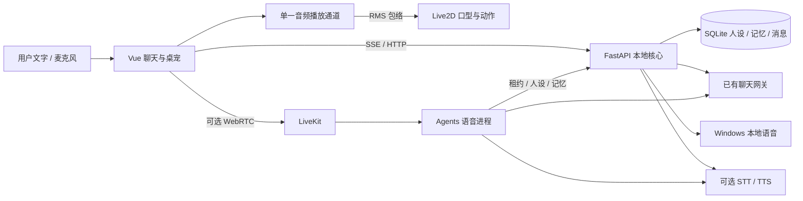

# 原型实现与架构

版本：0.1.0。此文档描述代码已落地范围及后续扩展方向。

## 技术选择

采用 Vue 3 + Electron 呈现桌宠，PixiJS 6 + pixi-live2d-display 0.4 加载 Cubism 模型；FastAPI 负责协议适配、人设和记忆，SQLAlchemy / SQLite 保存本地状态。语音由本地 SAPI 或兼容 TTS 起步，LiveKit worker 为后续实时通话提供独立入口。

AIRI 的 Live2D 包是私有 workspace 模块，与其大量前端状态及 monorepo 构建耦合。因此原型没有完整移植 AIRI 桌面端，而是复用其 MIT 眼动模块，并参考最终模型更新钩子与取景方式，实现一个较小的可独立运行桌面壳。详见 ASSETS.md。

## 代码地图

| 位置 | 职责 |
|---|---|
| `desktop/main.cjs` | 窗口、托盘、置顶、鼠标穿透、后台服务生命周期 |
| `desktop/preload.cjs` | 受限桌面能力桥接，无文件系统或任意代码执行接口 |
| `src/App.vue` | 聊天、人设、记忆、录音、语音房间及状态编排 |
| `src/components/Live2DStage.vue` | 角色加载、参数映射、视线、动作、取景、销毁 |
| `src/lib/audio.ts` | 单路播放、取消、PCM 分析与浏览器朗读降级 |
| `src/lib/api.ts` | 请求封装、跨分片 SSE 解析 |
| `src/lib/turn-gate.ts` | 会话、回复代次与事件序号校验 |
| `src/lib/model-files.ts` | 本地模型依赖解析与目录边界 |
| `backend/api.py` | 会话隔离、流式回复、显示确认、记忆管理、音频代理、语音租约 |
| `backend/providers.py` | 用户网关契约、提示词、中英语种、远程音频协议 |
| `backend/database.py` | 人设、会话、消息、记忆四类实体 |
| `backend/windows_speech.py` | 隐藏调用本机声音，输出临时 WAV |
| `backend/voice_worker.py` | LiveKit 语音 Agent、上下文同步、SDK 会话存储 |

## 文本会话一致性

每条用户消息有 `client_turn_id`，服务侧按会话去重。每个回复有 `generation_id`、`conversation_id`、`session_epoch` 和递增 `sequence`。前端忽略旧代次、旧会话和重复事件；新提交、停止、记忆更新都会取消旧工作。

事件：`assistant.started → assistant.delta* → assistant.generated`，或 `assistant.error / assistant.interrupted`。流中断而没有 `[DONE]` 或 `finish_reason` 不会误报完成。服务调用失败也不会悄悄退回示范回复。

数据库区分 `generated_text` 与 `delivered_text`。生成完整文本不代表已向用户显示；界面通过 delivery / interrupt 接口确认已显示前缀，服务检查该前缀真实属于本代回复。后续文本上下文仅使用确认显示的内容，避免把停止后未见的尾部当成对话事实。

这项确认指**文字显示**，不等同于「已听到的音频」。实时语音使用 SDK 的 playout / interruption 语义，当前对被打断助手条目保守弃用。不要把这两类确认混为一谈。

## 人设与记忆

人设由角色名、用户称呼、性格说明和语言偏好组成。提示词要求简短自然、有不同意见的空间、尊重自主性，不输出表情标签或角色动作旁白。情绪表现当前按有限规则（疲惫、难过等关键词）与界面状态映射，不宣称心理情绪识别。

记忆是用户显式维护的事实，最多 20 条，每条最多 1000 字符。没有后台自动抽取、向量库或未经确认的长期用户画像。记忆作为数据放入上下文，不作为高优先级指令。

修改 / 删除任何记忆或更新人设，会提高 profile revision，并取消进行中的生成及语音租约。旧聊天保留在界面，但旧 revision 的会话内容不再送入新的提示词。这样可防止已删除事实从旧聊天反复回流，代价是同时失去该次变更之前的短期上下文。

删除保存的记忆不等于物理擦除所有历史聊天。原型没有聊天删除 UI、账户删除或合规级数据擦除；上线前需要另做数据生命周期与用户导出 / 删除能力。

## Live2D 表现

真实读取模型参数，只向存在的参数写入值。SDK 的最终 `beforeModelUpdate` 钩子应用口型和表情，避免被动作曲线覆盖。图像保持比例，默认取景接近膝部以上；窗口尺寸变化后重新布局。

支持默认闲置动作、自然眨眼、微小扫视、鼠标视线、TapBody 点击动作和低动态开关。动作资源能提供多少变化由模型本身决定；没有生成不存在的骨骼动作。音频 RMS 平滑后驱动开口，尚非音素 / viseme 级对齐。

本地导入只允许一个 `.model3.json`，最多 160 文件 / 60 MB；引用必须在所选目录中，禁止绝对路径、上级目录和远程 URL，关闭导入 motion 的音频引用。模型数据不上传。导入资源保留到本次应用结束，长期资产管理和模型授权登记待后续实现。

## 桌面与本地边界

Electron 开启 `sandbox`、`contextIsolation`，禁用 renderer Node；仅暴露固定 IPC，验证发送方。阻止跳往外站和创建任意窗口，仅对本机 UI 开放音频权限。Cubism/Pixi 的着色器与运行时代码需要 CSP 中的 eval 能力，不能将此页面当作不受信任第三方内容容器。

API 监听 `127.0.0.1:18765`，检查 Host 与浏览器 Origin。通过 HttpOnly、SameSite Strict 随机 cookie 建立本地 profile，数据库保存 session hash。这里是本机 profile 隔离，**不是产品账户认证**，无法防御已能访问本机进程和文件的攻击者。

桌面仅停止自己启动的后端，不停止复用的已有服务。当前健康检查按服务标识识别，不包含安装目录身份，因此不要同时运行两个不同副本的后端。

## 从原型扩展为产品

| 阶段 | 推荐优先事项 | 出口标准 |
|---|---|---|
| 体验验证 | 填聊天 key；评估人设一致性与共情；试听自然 TTS；替换授权角色 | 真实用户完成 15–30 分钟中英试聊，并有明确改进清单 |
| 语音打磨 | LiveKit 联调、逐句合成、语义断句、精确已听前缀、回声与打断调参 | 中文、英文与混说测试通过，延迟分布和失败率可复现 |
| 数据产品化 | 登录鉴权、PostgreSQL、Alembic 迁移、Redis 会话所有权、导出与删除 | 多用户隔离、迁移回滚、删除语义通过验证 |
| 常驻桌宠 | 常用模型持久化、动作资源编排、主动互动节奏与静默设置、安装包签名 | 长时运行、资源占用、多显示器及升级测试通过 |
| 规模部署 | 配额、限流、审计、加密、观测、故障恢复 | 压测结果和运维手册满足产品目标 |

虽然当前 ORM 支持配置 PostgreSQL URL，但它并不等于已具备生产并发能力。进程内回复状态、租约和直接建表必须先改造，再部署多个副本。
